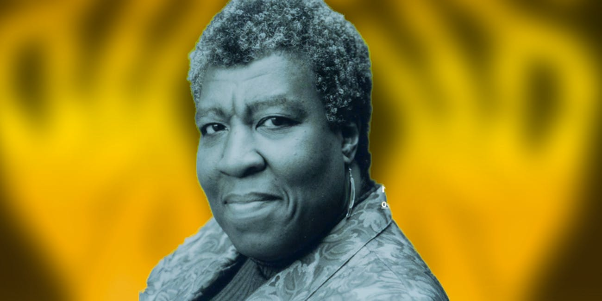

## Science fiction 

What is science fiction and how is it relevant to social issues?

1. Robert Scholes’s definition of science fiction (1975): 
    * “a fictional exploration of human situations made perceptible by the implications of recent science” 
    * Not necessarily scientific, doesn’t substitute for science. It’s the fictional possibilities that matter
    * (Source: Robert Scholes, *Structural Fabulation: An Essay on Fiction of the Future* (Indiana UP, 1975) 2.)

1. Darko Suvin (1979): Science fiction is **”literature of cognitive estrangement”** (NOT realistic)
    * SF introduces a *novum*: a “strange newness” that has to *sound possible*, and *as if* real or realistic
    * “a literary genre whose necessary and sufficient conditions are the presence and interaction of **estrangement** and **cognition**, and whose main formal device is **an imaginative framework alternative to the author’s empirical environment**.” 
    * (empirical = what can be observed in the real world. Here, Sci Fi must be outside the empirical world of the author. 
    * (Source: Source: Darko Suvin, Metamorphoses of Science Fiction: On the Poetics and History of a Literary Genre (Yale UP, 1979), 4, 7-8.) 

1. Gwyneth Jones (1999): Science fiction is a **”thought experiment”**
    * Raises a question: “what if?”
    * Explores possibilities of that question in a scientific way like a laboratory experiment in controlled conditions
    * “The business of the writer is to set up the equipment in a laboratory of the mind such that the ‘what if’ in question is at once isolated and provided with the exact nutrients it needs.”
    * (Source: Gwyneth Jones, Deconstructing Starships: Science, Fiction and Reality (Liverpool UP, 1999) 4.)

1. Samuel Delany (science fiction writer of the 1960s-70s, and Octavia Butler’s writing professor)
    * Perspective on Science Fiction as set of reading expectations: 
         * We read a sentence differently if we think it’s in a science fiction text: 
        * Example: **“Her world exploded.”**
    * Science fiction offers a *novum*, as Darko Suvin claims.  That *novum* is symbolic, **because it corresponds to our world in some way**, even while taking us beyond it

Science fiction: presents **possible worlds**, a hybrid of the realistic and the fantastic? 
    * fantasy (presents something new/strange and not consistent with our experience
    * realistic: in presenting something **possible** according to a rational, scientific or pseudoscientific epistemology
    
## Octavia Butler

* Background: <https://www.inverse.com/article/46317-octavia-butler-5-science-fiction-works-to-read>

Unusual approach to sci fi:
* strong emphasis on personal, subjectivity, characterization
* black women as lead characters
* Characters of color—race as a factor in identity
* changes fan base for science fiction

*Parable of the Sower* in context:

* First in Earthseed series re attempt to found a utopian community
* Next in series: *Parable of the Talents*
* Possibility of a third in the series—not completed

* Other series: *Patternist*  (alternative history)
alternative history—long-lived aliens on Earth disguised as aged human beings, over hundreds of years quietly shape human history)
* *Xenogenesis*  (postapocalyptic sci fi)
Group of people awake on a spaceship after earth’s destruction. 
* Human / Alien interactions:  relate to gender issues, plus racial and cultural conflicts of our world

   