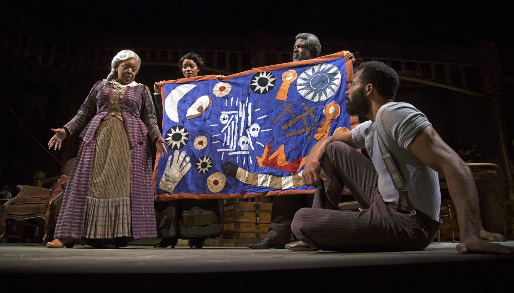

## Digital Project 3: Network and concept maps of August Wilson’s plays

]
source: [Orange Curtain Review, Orange County CA October-November 2017 production of *Gem of the Ocean*](http://theorangecurtainrev.com/gem-of-the-ocean-south-coast-repertory-in-costa-mesa-review/)

This digital project involves creating concept and network maps to help visualize patterns in August Wilson’s plays, *Gem of the Ocean* and *Radio Golf*. We will work with Google Sheets again, but in a new way, to organize information about related concepts and map it with [Kumu’s free visualization platform](https://kumu.io/). We will get started by [setting up accounts following Kumu’s documentation](https://docs.kumu.io/getting-started/first-steps.html), and we will be exploring how to structure and import data from a published Google Sheet following [Kumu’s documentation](https://docs.kumu.io/guides/import.html). The first challenge for us will be determining what kinds of patterns we are interested in visualizing. Each student records and visualizes pattern individually, choosing options, such as:

* social network: who is on stage together in the same scenes, and what locations connect characters?
* material objects and which characters are connected with them
* symbolic concepts and material objects in the plays
    * for example: diagram the journey to the City of Bones 
* characters who share identities and community personas

### Phase 1: 
In class we will start with some planning exercises to set up the columns in Google Sheets and experiment with visualizations.

The Google Sheet will have two tabs, one for Elements and one for Connections. Elements provide basic information on each node you want to map, such as, for Aunt Ester, that she is a person seen on stage, that she is a spiritual leader, and (if you wish) has an image. The Connections sheet records connections Aunt Ester has with others. The visualization can indicate whether she made or received those connections (to give the association a *direction* from agent to recipient), or whether the connection is simply mutual or shared. 

Begin setting it up following my [starter template file](https://docs.google.com/spreadsheets/d/1i-4uVGx8SCdELPQIkLW9d3PVmj8BcJcrvnPzxLsIPH4/edit?usp=sharing).

To help give you an idea of how you can build “maps” or networks with the date you are collecting, here are some sample files:
* [a sample Google Sheet](https://docs.google.com/spreadsheets/d/1W72Vx7JVN0GysZ1x0tHR5Z5ULHBYCvnqkZzjnF7i0I0/edit?usp=sharing) that I began with a set of data on people and objects on and offstage in the play.
* Here is a [network visualization made with the sheet above](https://kumu.io/ebeshero/dr-bs-august-wilson-experimental-network#augustwilsonstarter)

*Note: Assignment under construction:* This is a new assignment, so we will test the setup beginning in class on Tuesday 2/19 and continue developing the assignment requirements in consultation between the professor and students. There will be an essay calling for observation of patterns and reflection on the visualizations we develop and what they show us about issues and concepts and the representation of Pittsburgh’s communities in August Wilson’s plays. I will post more as we work out the details.  
