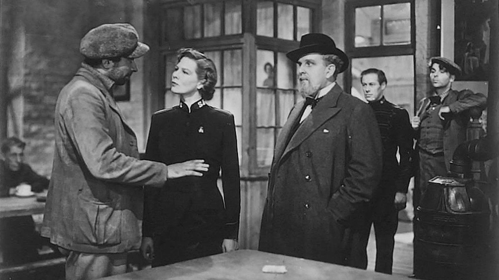

## Digital Project 4: Annotate *Major Barbara*

When it first premiered in London in 1905, *Major Barbara* was called a “discussion in three acts” on the play bill.

Calling it a “discussion” spoke to G. B. Shaw’s approach to plays as provocative conversations, structured around polarized social issues. Sparks flying in conversation would often generate heated ironies, moments when audiences recognize a different meaning than the one intended, or when a point is made in order to emphasize its opposite. In watching and reading a play of ideas like this, it helps to annotate the language to look up unfamiliar words and historical references, to provide pictures and media to help an idea from the past come to life in our moment. It will also help us to flag some of the passages that suddenly make us laugh: what is so funny? Can we point out how the irony is working? One of Shaw’s goals for staging plays was to keep people talking about the ideas after they exited the theater, and annotating is one way for us to hold a conversation with the play, to respond to key passages and reflect on them. 

The assignment involves us writing online annotations as a class group on [the Project Gutenberg HTML edition of *Major Barbara*](https://www.gutenberg.org/files/3790/3790-h/3790-h.htm). We will work with the free online annotation software, [Hypothes.is](https://web.hypothes.is/), which will involve some quick initial configuration, which we will do together in class.

### Hypothes.is Annotation 
1. Start by setting up a free account here: https://web.hypothes.is/start/

2. With your new account configured, join our private class annotation group here by following this link:  <https://hypothes.is/groups/vD73ga7G/soclit-2019>
3. Set up hypothes.is to run in your preferred browser, [following the instructions](https://web.hypothes.is/start/). There is an extension in Google Chrome, or a “bookmarklet” for other browsers.

4. Open our [Project Gutenberg HTML edition of *Major Barbara*](https://www.gutenberg.org/files/3790/3790-h/3790-h.htm) in your browser, and open the hypothes.is extension or bookmarklet.
5. At the top of the hypothes.is screen, you want to change the share setting from “Public” to our class group, “socLit_2019”. This allows us to see each other’s annotations and communicate as a group. 

### The Annotation Assignment
As you read, write annotations in hypothes.is to:
* Comment on irony: Where do you find it, and what is generating it?
* Explain unfamiliar words. 
    * Since we are reading a play in British English, look up words first in the Oxford English Dictionary (via the Pitt Digital Library Database login with your Pitt id and password). Choose what strikes you as the best-fitting definition for word, and explain how this word fits into the context of the larger phrase around it: Why does this word fit here?  
* Identify unfamiliar contexts: Link to informative web references to historical events, proper names, organizations mentioned in the play, and provide a clear and to-the-point explanation of what significance they have, to help us understand a passage in the play. 
* Embed relevant images and multimedia from the web in your annotations to help us visualize something more clearly. 
* Raise questions and respond to each other’s annotations.
Your writing for this assignment is entirely in the annotations you are drafting, so think of these as a series of short explanatory and conversational pieces tuned to specific passages of the play. I will be evaluating your annotations for:
* accuracy in representing definitions and context
* accuracy and relevance in commentary on the play
* clear writing and helpfulness of your annotations in adding to the discussion surrounding this play. 

*Image source: 1941 movie production starring Wendy Hiller and Rex Harrison, General Film Distributors. The movie, filmed during the Blitz of London, was based closely on G. B. Shaw’s play, which was first staged in 1905.*

