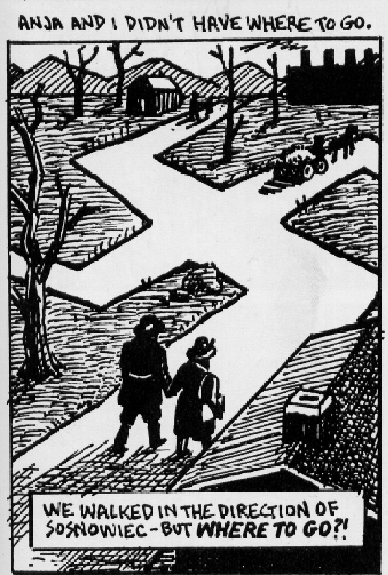

## Analog Project 5: Graphic Analysis of *Maus*

*Maus* is full of **dramatic irony**, when what we as the readers comprehend is different from what the characters see and understand in their limited moment. In attempting to document the tensions between family members over generations and attempting to record and transmit Vladek Spiegelman’s experience of the Nazi holocaust in Poland and Germany and its after effects in New York, Art Spiegelman makes every chapter **juxtapose** the past of Vladek’s narrations with disturbances and distress at the moment of recording. Sometimes the narrative shows the author in the process of writing, showing us that this comic is not just about one storyline, but about World War II, the 1960s, and the 1980s bound and interconnected together. 

This assignment involves identifying a pattern in the way *Maus* layers or juxtaposes Art’s and Vladek’s points of view. Explore two or three of the following options to develop into a graphic analysis, working closely with panels and page layouts.

* How do the drawings show us more than we could pick up from the words being spoken by the characters?
* How do sudden interruptions from one time frame intrude on another? Do these interruptions help signal or show us something more than the direct narration? 
* How do sudden departures from the dominant style of the drawings (as for example, the presence of a real photo, or the Prisoner from the Hell Planet sequence) affect our reading and view of the characters?
* How do chapters organize layers of time? How does time layering become more complicated in *Maus II*?
* How does narrative make us aware of loss and unavailability of evidence about the past? In telling Vladek’s story, have we lost Anja’s?

Develop a 4 to 5 page (double-spaced) essay that works closely with a representative selection of chapters, pages, and panels in Maus I and II that help you to explore its ironic dimensions and juxtapositioning of time. Refer to panels specifically by counting them in the sequence with which you read them. So, for example, the panel illustrated at the top of this assignment page from *Maus* Book I page 125 panel 5, should be cited like this (*Maus I*: 125, panel 5).

Upload your paper on the Assignments tab in [Courseweb](https://courseweb.pitt.edu) by the due date, Thursday 4/18 by 11:59pm.
